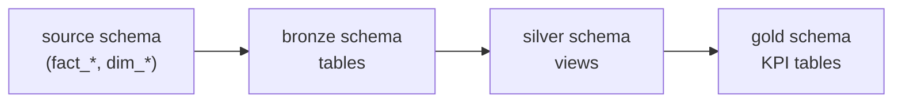

# dbt_tutorial

A hands-on **dbt** learning repository: medallion architecture (bronze → silver → gold), Jinja macros, tests, seeds, and analyses on **Databricks**.

The dbt project lives in [`dbt_learning/`](dbt_learning/). Start there for models and layer-specific docs.

---

## Repository layout

```
dbt_tutorial/
├── dbt_learning/          # dbt project (models, macros, tests, analyses)
│   ├── models/
│   │   ├── bronze/        # staging — see models/bronze/README.md
│   │   ├── silver/        # cleansed — see models/silver/README.md
│   │   ├── gold/          # business KPIs — see models/gold/README.md
│   │   └── source/        # source definitions (source.yml)
│   ├── macros/
│   ├── tests/
│   ├── analyses/
│   ├── seeds/
│   └── commands/          # CLI reference
├── requirement.txt        # Python dependencies (dbt-databricks, etc.)
├── uv.lock                # Lockfile (if using uv)
└── .python-version        # Python 3.9
```

---

## Prerequisites

- Python 3.9+ (project uses 3.9)
- Access to a Databricks workspace and SQL warehouse
- `profiles.yml` configured for the `dbt_learning` profile (see [dbt profiles](https://docs.getdbt.com/docs/core/connect-data-platform/profiles.yml); keep secrets out of git)

---

## Setup

From the repo root:

```bash
# Option A: uv (if you use uv)
uv sync

# Option B: venv + pip
python -m venv .venv
.venv\Scripts\activate          # Windows
pip install -r requirement.txt
```

Configure connection in `dbt_learning/profiles.yml` (or `~/.dbt/profiles.yml`).

---

## Quick start

```bash
cd dbt_learning
dbt debug
dbt seed                        # optional: lookup_test seed
dbt run --select bronze         # build bronze tables first
dbt run --select silver         # or: dbt run --select +silver
dbt run --select +gold          # KPI aggregates (needs silver)
dbt test
```

Build everything (models + tests):

```bash
dbt build
```

---

## Medallion flow in this repo



| Layer | Schema | Materialization | Docs |
|-------|--------|-----------------|------|
| Sources | `source` | External tables | [source.yml](dbt_learning/models/source/source.yml) |
| Bronze | `bronze` | Tables | [models/bronze/README.md](dbt_learning/models/bronze/README.md) |
| Silver | `silver` | Views | [models/silver/README.md](dbt_learning/models/silver/README.md) |
| Gold | `gold` | Tables | [models/gold/README.md](dbt_learning/models/gold/README.md) |

---

## Documentation index

| Topic | Location |
|-------|----------|
| Project overview | [dbt_learning/README.md](dbt_learning/README.md) |
| Bronze layer | [dbt_learning/models/bronze/README.md](dbt_learning/models/bronze/README.md) |
| Silver layer | [dbt_learning/models/silver/README.md](dbt_learning/models/silver/README.md) |
| Gold layer | [dbt_learning/models/gold/README.md](dbt_learning/models/gold/README.md) |
| Macros & helper compile workflow | [dbt_learning/macros/README.md](dbt_learning/macros/README.md) |
| Analyses & Jinja | [dbt_learning/analyses/README.md](dbt_learning/analyses/README.md) · [README-jinja.md](dbt_learning/analyses/README-jinja.md) |
| Tests | [dbt_learning/tests/README.md](dbt_learning/tests/README.md) |
| CLI commands | [dbt_learning/commands/README.md](dbt_learning/commands/README.md) |
| Seeds | [dbt_learning/seeds/README.md](dbt_learning/seeds/README.md) |

---

## Common commands

```bash
cd dbt_learning

dbt run --select bronze                    # all bronze models
dbt run --select silver                    # silver only (needs bronze built)
dbt run --select +silver                   # silver + missing parents (e.g. bronze_returns)
dbt run --select +gold                     # gold KPIs + silver/bronze parents
dbt run --select bronze_returns silver_returns

dbt compile --select path:analyses/test_sales_data.sql
dbt test --select bronze_sales
```

---

## Learn more

- [dbt documentation](https://docs.getdbt.com/docs/introduction)
- [Medallion architecture](https://www.databricks.com/glossary/medallion-architecture)
