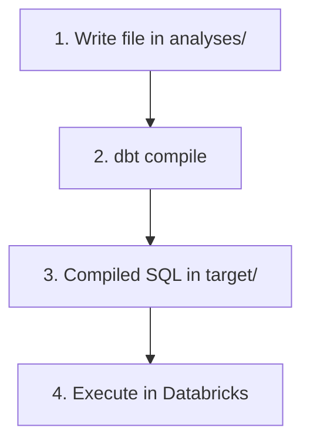

# Jinja in dbt (learning guide)

This guide explains **Jinja** — the templating language inside dbt `*.sql` files — using the practice analyses in this folder:

| File | What you practice |
|------|-------------------|
| [jinja-1.sql](jinja-1.sql) | Variables (`set`, `{{ }}`) |
| [jinja-2.sql](jinja-2.sql) | Lists, `for` loops, `if` / `else` |
| [Jinja-3.sql](Jinja-3.sql) | Dynamic SQL: column list, `ref()`, incremental-style `where` |

Analyses are a safe place to experiment: **compile only**, no table is built. See [README.md](README.md) for how analyses work.

---

## What is Jinja?

**SQL** is what the warehouse runs. **Jinja** is logic that runs *before* SQL is sent to the warehouse — at **compile time**.

dbt reads your file → evaluates Jinja → produces plain SQL under `target/compiled/`.

**Compile flow (example: `Jinja-3.sql`)**

| Step | What happens |
|------|----------------|
| 1 | You write Jinja + SQL in `analyses/` |
| 2 | `dbt compile` expands Jinja |
| 3 | Plain SQL is written to `target/compiled/` |
| 4 | You run that SQL in Databricks (analyses are not built by `dbt run`) |



You will see Jinja in:

- **Models** (`models/`) — transforms, configs, dynamic columns
- **Analyses** (`analyses/`) — learning and ad hoc queries (this guide)
- **Macros** (`macros/`) — reusable Jinja functions (e.g. `generate_schema.sql`)
- **Tests** — sometimes Jinja for flexible checks

---

## The four syntax pieces

| Syntax | Name | Purpose | Example |
|--------|------|---------|---------|
| `{{ ... }}` | Expression | **Print** a value into the file | `{{ ref('bronze_sales') }}` |
| `` | Statement | **Do** something (if, for, set) — no direct print | `` |
| `{# ... #}` | Comment | Notes for humans; **removed** at compile | `{# incremental load #}` |
| `` | Whitespace trim | Strip spaces/newlines around tags | `` |

### Whitespace control (`-`)

Without `-`, Jinja often leaves blank lines in compiled SQL. With `-`, you trim whitespace **on that side** of the tag.

```jinja
   {# tight — good for SQL #}
      {# may leave extra newlines #}
```

**Tip:** In models and analyses that become SQL, prefer `` on `set`, `for`, and `if` tags.

---

## How to compile and see the result

From `dbt_learning/`:

```bash
# One file — match exact filename casing!
dbt compile --select jinja-1
dbt compile --select jinja-2
dbt compile --select Jinja-3

# Or by path
dbt compile --select path:analyses/Jinja-3.sql
```

Open compiled output:

```
target/compiled/dbt_learning/analyses/<name>.sql
```

| Command | Wrong | Right |
|---------|-------|-------|
| Select `Jinja-3.sql` | `jinja-3` | `Jinja-3` (same casing as file) |

List all analysis names:

```bash
dbt ls --resource-type analysis
```

---

## Lesson 1: Variables — `jinja-1.sql`

### Source

```jinja


{{ var_name }}
```

### What happens

1. **``** — creates a Jinja variable (not a column in the database).
2. **`{{ var_name }}`** — **prints** the value into the compiled file.

### Compiled output

```
Piyush
```

There is no `SELECT` here — the file is **only Jinja**. That is fine for learning; `jinja-3.sql` mixes Jinja with real SQL.

### Rules to remember

- `set` uses `` (statement), not `{{ }}`.
- `{{ }}` is for **output**.
- Strings use quotes: `"Piyush"` or `'Piyush'`.
- Variable names are case-sensitive: `var_name` ≠ `Var_Name`.

### Try it yourself

1. Change the name and recompile.
2. Add a second variable and print both: `{{ first }} {{ last }}`.
3. Use `set` with a number: `` then `{{ n }}`.

---

## Lesson 2: Loops and conditions — `jinja-2.sql`

### Source

```jinja



    
        {{ i }}
    
    I hate {{ i }}
    

```

### Concepts

| Piece | Meaning |
|-------|---------|
| `["red", "green", "yellow"]` | Jinja **list** |
| `for i in apples` | Loop over each item |
| `if i != "red"` | Branch per item |
| `{{ i }}` | Print current item |

### Compiled output

```
I hate red
        green
        yellow
```

Non-red apples print the color; red prints `I hate red`. Whitespace trimming is why spacing looks tight in places — experiment by removing `-` and recompiling to see the difference.

### `for` loop helpers (useful in models)

Inside a `for` loop, Jinja provides:

| Variable | Meaning |
|----------|---------|
| `loop.index` | 1-based index |
| `loop.first` | `True` on first iteration |
| `loop.last` | `True` on last iteration |
| `loop.length` | Total items |

You will use **`loop.last`** in `Jinja-3.sql` to avoid a trailing comma in SQL.

### Try it yourself

1. Add `"blue"` to the list and recompile.
2. Change the condition to `if i == "green"`.
3. Print `{{ loop.index }}` beside each item inside the loop.

---

## Lesson 3: Dynamic SQL — `Jinja-3.sql`

This file is closest to **real dbt models**: variables + loop + `ref()` + conditional `WHERE`.

### Source

```jinja





select 
    
        {{ col }}
        , 
    
from 
    {{ ref('bronze_sales') }}


where date_sk > {{ last_load }}

```

### Step-by-step

**1. Configuration variables**

```jinja


```

In a model, these might come from `var('inc_flag')` in `dbt_project.yml` instead of hard-coding. Here they stand in for “incremental load is on” and “only rows after date_sk 3”.

**2. Dynamic column list**

```jinja

    {{ col }}
    , 

```

- Each `{{ col }}` becomes a column name in SQL.
- `if not loop.last` adds a comma **between** columns, not after the last one.

**3. `ref()` — dbt’s pointer to another node**

```jinja
{{ ref('bronze_sales') }}
```

At compile time, dbt resolves this to the full table name for `bronze_sales` (after `dbt run` has built it).

**4. Conditional `WHERE` (incremental pattern)**

```jinja

where date_sk > {{ last_load }}

```

- If `inc_flag == 1`, the `WHERE` clause is included.
- If you set `inc_flag = 0` and recompile, the `WHERE` disappears entirely.

### Compiled output (example)

```sql
select
        sales_id,
        date_sk,
        gross_amount
from
    `dbt_learning_dev`.`bronze`.`bronze_sales`

where date_sk > 3
```

### Prerequisites before compiling

```bash
dbt run --select bronze_sales    # model must exist for ref()
dbt compile --select Jinja-3
```

### Try it yourself

1. Set `inc_flag = 0`, compile, confirm there is no `WHERE`.
2. Add `"net_amount"` to `cols_list` and recompile.
3. Change `last_load` to `5` and see the compiled filter change.
4. Replace hard-coded `inc_flag` with `{{ var('inc_flag', 0) }}` (define `vars` in `dbt_project.yml`).

---

## Jinja vs SQL: mental model

| | Jinja | SQL |
|---|--------|-----|
| **When it runs** | On your machine at `dbt compile` / `dbt run` | In the warehouse |
| **Who sees it** | Developers in Git | Database engine |
| **Goal** | Generate SQL text | Query data |

**Wrong:** thinking `` creates a warehouse variable.  
**Right:** it only affects the **text** dbt writes to the compiled file.

---

## dbt helpers you will use next

These are not in the three practice files but appear everywhere in models:

| Syntax | Purpose |
|--------|---------|
| `{{ ref('model_name') }}` | Reference a model or seed |
| `{{ source('source_name', 'table_name') }}` | Reference a declared source |
| `{{ config(materialized='table') }}` | Set model config |
| `` | Call a macro |
| `{{ var('my_var') }}` | Project variable from `dbt_project.yml` |
| `{{ env_var('API_KEY') }}` | Environment variable |

Example macro in this project: `macros/generate_schema.sql` — custom schema naming using `...`.

---

## Common mistakes

| Mistake | Fix |
|---------|-----|
| `dbt compile --select jinja-3` for file `Jinja-3.sql` | Use `Jinja-3` or `path:analyses/Jinja-3.sql` |
| Using `{{ set x = 1 }}` | Use `` for assignment |
| Trailing comma in dynamic SELECT | Use `,` |
| `ref()` fails at compile | Run upstream model first: `dbt run --select bronze_sales` |
| Expecting `dbt run` to run analyses | Use `dbt compile`, then run compiled SQL in the warehouse |
| Comparing strings with wrong quotes | `` — quotes must match |

---

## Suggested learning path

```text
jinja-1.sql   →  variables and printing
      ↓
jinja-2.sql   →  lists, for, if/else, loop.*
      ↓
Jinja-3.sql   →  dynamic SQL + ref() + conditional WHERE
      ↓
models/       →  move patterns into bronze/silver models
      ↓
macros/       →  reuse logic (see generate_schema.sql)
```

---

## Practice challenges

1. **Dynamic filter list** — In a new analysis, `set statuses = ['A','B']` and build `WHERE status IN (...)` with a `for` loop.
2. **Optional column** — `set include_net = true` and only add `net_amount` to the SELECT when true.
3. **Macro call** — Read `macros/generate_schema.sql` and explain what it returns when `custom_schema_name` is `bronze`.
4. **Compare compile** — Change one line in `Jinja-3.sql`, run `dbt compile`, and diff the old vs new file under `target/compiled/`.

---

## Commands cheat sheet

```bash
dbt compile --select jinja-1
dbt compile --select jinja-2
dbt compile --select Jinja-3
dbt ls --resource-type analysis
```

More CLI detail: [commands/analyses.md](../commands/analyses.md).

---

## Further reading

- [dbt Jinja & macros](https://docs.getdbt.com/docs/build/jinja-macros)
- [Jinja template designer documentation](https://jinja.palletsprojects.com/en/stable/templates/)
- [Analyses in this project](README.md)
