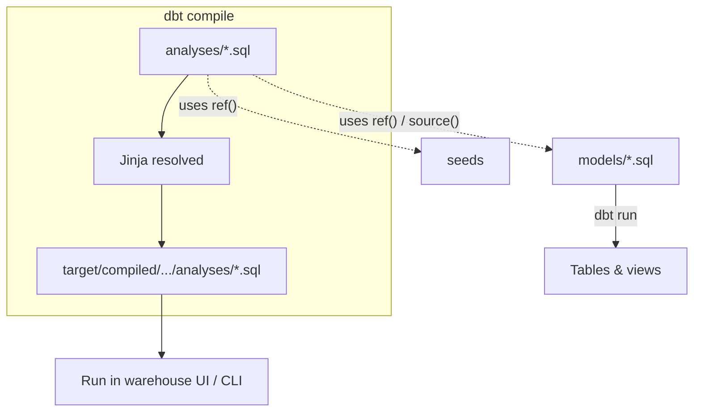

# dbt Analyses

Documentation for the `analyses/` folder in **dbt_learning**. Analyses are a dbt resource type for **exploratory SQL that is compiled but not built** in the warehouse as part of `dbt run`. See the [project README](../README.md) for other concepts.

---

## What is an analysis?

An **analysis** is a `.sql` file under `analyses/` that dbt **parses and compiles** (Jinja → plain SQL) but **does not materialize** as a table or view. Nothing from this folder is created or updated when you run:

```bash
dbt run
dbt build
```

Instead, you use analyses to:

- Explore data and prototype logic **before** promoting SQL to a model.
- Share **version-controlled, reviewable queries** that still use `ref()`, `source()`, and macros.
- Keep **one-off or stakeholder questions** in the repo without polluting the production DAG.

Think of analyses as **“SQL notebooks in your dbt project”** — they get the benefits of dbt’s dependency graph and compilation, without becoming warehouse objects.

---

## What are analyses for?

| Use case | Why an analysis fits |
|----------|----------------------|
| Prototyping a new model | Try joins and filters; when stable, move SQL to `models/` |
| Investigating a test failure | Drill into failing rows with `ref('bronze_sales')` |
| Ad hoc business questions | “Show lookup customers with id ≤ 5” without a permanent view |
| Documenting an investigation | Git history captures *how* you explored an issue |
| Teaching / demos | Runnable examples that reference project seeds and models |

Analyses are **not** for:

- Production tables or dashboards → use **models**.
- Assertions that should fail CI → use **tests**.
- Small static reference data → use **seeds**.
- Tracking history of a table over time → use **snapshots**.

---

## How analyses fit in the dbt workflow



1. You write SQL in `analyses/` using `ref()`, `source()`, `{{ config }}` is ignored for materialization, etc.
2. You run **`dbt compile`** (or compile a single analysis) so dbt resolves Jinja against your manifest.
3. dbt writes **compiled SQL** under `target/compiled/<project>/analyses/`.
4. You **execute that SQL** in Databricks SQL, the dbt IDE, or your SQL client — manually or via your own tooling.

Analyses **do not** appear in `dbt run`’s build list. They can still **depend on** models and seeds via `ref()`; those dependencies must already exist (run `dbt seed` / `dbt run` first if your analysis queries them).

---

## Files in this folder

| File | Purpose |
|------|---------|
| `lookup_analysis.sql` | Example: query the `lookup_test` seed with a simple filter |
| `jinja-1.sql`, `jinja-2.sql`, `Jinja-3.sql` | Jinja practice (variables → loops → dynamic SQL) — see **[README-jinja.md](README-jinja.md)** |

### Example: `lookup_analysis.sql`

```sql
select *
from {{ ref("lookup_test") }}
where customer_id <= 5
```

After compile, this becomes warehouse-ready SQL referencing the seeded table for `lookup_test` (see [seeds/README.md](../seeds/README.md)). The filter is exploratory — it is not enforced as a test and does not create a bronze/gold object.

**Prerequisite:** Load the seed before compiling or running:

```bash
dbt seed --select lookup_test
dbt compile --select lookup_analysis
```

Compiled output path (typical):

```
target/compiled/dbt_learning/analyses/lookup_analysis.sql
```

Open that file, copy the SQL into your warehouse, or use your editor’s “run compiled query” flow if integrated with dbt.

---

## Analyses vs models vs tests

| | **Analysis** | **Model** | **Test** |
|---|--------------|-----------|----------|
| Location | `analyses/` | `models/` | `tests/` or YAML on models |
| Built on `dbt run`? | No | Yes | No (runs on `dbt test`) |
| Creates warehouse object? | No | Yes (table/view/incremental) | No |
| Typical goal | Explore / prototype | Transform & serve data | Validate data quality |
| Uses `ref()`? | Yes | Yes | Often yes |
| Compiled SQL | Yes (`dbt compile`) | Yes (`dbt run` / compile) | Yes |

**Promotion path:** When an analysis query becomes something you need every day in the pipeline, **copy or refactor it into `models/`**, add tests in YAML, and remove or archive the analysis so you do not maintain two sources of truth.

---

## Commands

```bash
# Compile all analyses (and other resources)
dbt compile

# Compile one analysis by name (file name without .sql)
dbt compile --select lookup_analysis

# List analyses in the project (dbt 1.x+)
dbt ls --resource-type analysis

# Ensure dependencies exist first
dbt seed --select lookup_test
dbt run --select bronze_customer   # if your analysis refs bronze models
```

There is **no** `dbt run --select lookup_analysis` that builds a relation — by design.

### Optional: preview with `dbt show`

On supported adapters and dbt versions, `dbt show` can execute compiled model/analysis-style SQL and print a sample result in the terminal. Behavior depends on your adapter; if `dbt show --select lookup_analysis` is available in your environment, it is a quick way to preview without opening the warehouse UI.

---

## Writing good analyses

1. **Name files clearly** — `lookup_analysis.sql` describes intent better than `query1.sql`.
2. **Use `ref()` and `source()`** — avoid hard-coded `database.schema.table` so compile-time lineage stays correct.
3. **Keep scope small** — one question per file; split large investigations.
4. **Comment non-obvious logic** — future you (and reviewers) will read this in a PR.
5. **Do not commit secrets** — analyses are SQL in Git; use env vars / profiles for credentials, not inline keys.
6. **Promote or delete** — stale analyses confuse newcomers; either move logic to models or delete when done.

---

## Configuration

In `dbt_project.yml`, analyses are discovered via:

```yaml
analysis-paths: ["analyses"]
```

Unlike models, analyses typically need **little or no** per-file config — no `materialized`, `schema`, or incremental strategy. They inherit the project’s macro paths and can call any macro in `macros/`.

You generally **do not** document analyses in `schema.yml` the same way as models; if you need rich docs and tests, that is a signal to use a **model** instead.

---

## How analyses relate to this project

| Dependency | Role |
|------------|------|
| [seeds/lookup_test.csv](../seeds/lookup_test.csv) | Loaded with `dbt seed`; referenced by `lookup_analysis` |
| [models/](../models/) | Bronze/silver/gold transforms; reference these in analyses when exploring production-shaped data |
| [tests/](../tests/) | After an analysis explains a failure, fix the model and lock behavior with tests |

Example investigation flow:

1. `dbt test` fails on `bronze_sales`.
2. Add `analyses/debug_sales_spike.sql` with `ref('bronze_sales')` and filters.
3. `dbt compile --select debug_sales_spike` → run compiled SQL in Databricks.
4. Fix `models/bronze/bronze_sales.sql`, add a test, delete or keep the analysis for history.

---

## Common pitfalls

| Pitfall | What to do |
|---------|------------|
| `ref()` fails at compile time | Run `dbt seed` / `dbt run` for dependencies first, or use `dbt compile` in an environment where the manifest is up to date |
| Expecting a table after compile | Analyses never create objects; only compiled files under `target/` |
| Duplicating logic in model + analysis | Promote to model and remove duplicate, or have the model be the single source of truth |
| Huge result sets | Add `LIMIT` in the analysis while exploring; warehouses still scan underlying data |

---

## Further reading

- [Analyses](https://docs.getdbt.com/docs/build/analyses)
- [dbt compile](https://docs.getdbt.com/reference/commands/compile)
- [Seeds in this project](../seeds/README.md) — dependency used by `lookup_analysis.sql`
