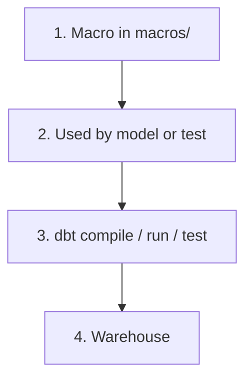

# dbt Macros

Documentation for the `macros/` folder in **dbt_learning**. Macros are reusable **Jinja functions** that generate SQL or config at compile time. See the [project README](../README.md) and [analyses/README-jinja.md](../analyses/README-jinja.md) for Jinja basics.

---

## What is a macro?

A **macro** is a named block of Jinja (often wrapping SQL) that you define once and reuse across models, tests, and analyses.

```jinja

    -- SQL or text dbt will inject when the macro is called

```

Call it with:

```jinja
{{ my_macro('value1', 'value2') }}
```

Macros run at **compile time** (same as other Jinja) — they produce text that becomes part of your SQL. They do not run as separate jobs in the warehouse.

| Step | What happens |
|------|----------------|
| 1 | Define logic in `macros/*.sql` |
| 2 | Models or YAML tests call the macro |
| 3 | `dbt run` / `dbt test` / `dbt compile` expands macros into SQL |
| 4 | Warehouse runs the final SQL |



In `dbt_project.yml`, dbt looks for macros here:

```yaml
macro-paths: ["macros"]
```

---

## What are macros for?

| Use case | Example in this project |
|----------|-------------------------|
| **Reuse SQL patterns** | Shared `CASE` logic, repeated joins |
| **Custom generic tests** | `generic_non_negative` on a column |
| **Override dbt behavior** | `generate_schema_name` — where models land in the warehouse |
| **Dynamic DDL/helpers** | Utility macros from `dbt-utils` (if you add packages) |

Macros are **not** a place for one-off exploratory queries — use [analyses/](../analyses/README.md).  
Macros are **not** full table builds — use [models/](../models/).

---

## Files in this folder

| File | Type | Purpose |
|------|------|---------|
| [generate_schema.sql](generate_schema.sql) | **Override macro** | Controls target schema for models/seeds |
| [generic_non_negative.sql](generic_non_negative.sql) | **Generic test macro** | Fails if any row has `column < 0` |
| [round_macro.sql](round_macro.sql) | **Helper macro** | `round_column` — rounds a column to N decimal places |

---

## Macro vs generic test vs singular test

| | **Macro** (``) | **Generic test** (``) | **Singular test** (`tests/*.sql`) |
|---|---------------------------|----------------------------------|-----------------------------------|
| Lives in | `macros/` | `macros/` | `tests/` |
| Invoked via | `{{ macro_name() }}` in SQL, or YAML for tests | `data_tests:` in `properties.yml` | `dbt test` on file name |
| Reusable | Yes | Yes (per column in YAML) | One-off SQL file |
| This project | `generate_schema_name` | `generic_non_negative` | `non_negative_test.sql` |

**Important:** `` blocks belong in **`macros/`**, not `tests/`. If you put a test macro under `tests/`, dbt may treat it as a singular test and fail.

---

## 1. `generate_schema_name` — schema override

### Source

```jinja


    
    

        {{ default_schema }}

    

       {{ custom_schema_name | trim }}

    


```

### What it does

dbt calls this macro **automatically** for every model and seed to decide which **schema** (database namespace) to use. You do not call it yourself in model SQL.

| `custom_schema_name` | Result |
|----------------------|--------|
| `none` (not set in config) | Uses `target.schema` from your profile (default dev schema) |
| Set (e.g. `bronze` in `dbt_project.yml`) | Uses that name (trimmed) |

This project sets bronze models and `lookup_test` seed to schema **`bronze`** in `dbt_project.yml`, so they build into `...bronze...` instead of only the default profile schema.

### Jinja concepts used

| Piece | Role |
|-------|------|
| `custom_schema_name`, `node` | Arguments dbt passes in (you must keep the signature for overrides) |
| `target.schema` | Built-in dbt object — current target’s default schema |
| `is none` | Check if no custom schema was configured |
| `\| trim` | Jinja filter — remove leading/trailing spaces |

### Try it yourself

1. Run `dbt run --select bronze_sales` and note the schema in the logs or compiled SQL.
2. Temporarily remove `schema: bronze` from `dbt_project.yml` for bronze, re-run, and compare where the table lands.

---

## 2. `generic_non_negative` — custom generic test

### Source

```jinja


select
    *
from {{ model }}
where {{ column_name }} < 0


```

### What it does

A **generic test** is a macro that returns SQL selecting **failing rows**. If the query returns **zero rows**, the test passes. If any row is returned, the test fails.

This test checks: “no rows where `column_name` is negative.”

### How it is wired in this project

In `models/bronze/properties.yml`:

```yaml
columns:
  - name: gross_amount
    data_tests:
      - generic_non_negative
```

dbt expands that to a test on `bronze_sales.gross_amount` using your macro.

### Run the test

```bash
dbt run --select bronze_sales
dbt test --select bronze_sales
# or only this test type:
dbt test --select bronze_sales,test_type:generic
```

Find the exact test node name:

```bash
dbt ls --resource-type test --select bronze_sales
```

### Arguments dbt passes to generic tests

| Argument | Meaning |
|----------|---------|
| `model` | Relation ref to the model under test |
| `column_name` | Column from YAML (`gross_amount`) |

You can add optional arguments in YAML:

```yaml
data_tests:
  - generic_non_negative:
      column_name: gross_amount   # implicit when used as column test
```

For macros with extra params, pass them in the YAML list item.

### Try it yourself

1. Run `dbt test --select bronze_sales` and confirm `generic_non_negative` runs.
2. Read compiled test SQL under `target/compiled/dbt_learning/` (test paths vary by dbt version).
3. (Dev only) Imagine a negative `gross_amount` in source data — the test should fail.

---

## Calling macros in models and analyses

**User-defined macros** (not special overrides) are called with `{{ }}`:

```sql
-- example only — not in this repo yet
select
    {{ cents_to_dollars('amount_cents') }} as amount_usd
from {{ ref('bronze_sales') }}
```

**Built-in dbt macros** you will see often:

| Macro | Purpose |
|-------|---------|
| `ref('model_name')` | Reference a model or seed |
| `source('source_name', 'table')` | Reference a source table |
| `config(...)` | Set model configuration |
| `var('name')` | Read project variables |
| `adapter.dispatch(...)` | Adapter-specific macro (advanced) |

Override macros like `generate_schema_name` are invoked by **dbt internals**, not by you directly.

---

## How macros relate to the rest of the project

```text
macros/generate_schema.sql     →  bronze / silver / gold schema routing
macros/generic_non_negative.sql →  YAML on bronze_sales.gross_amount
models/bronze/*.sql            →  may call custom macros in the future
analyses/macro_round_test.sql  →  preview round_column via dbt compile
analyses/*.sql                 →  Jinja practice; can call macros too
tests/non_negative_test.sql    →  singular test (separate from macro tests)
```

| Learn here | Then |
|------------|------|
| [README-jinja.md](../analyses/README-jinja.md) | Variables, `for`, `if` in analyses |
| This README | Reusable `` and `` |
| [tests/README.md](../tests/README.md) | Running and organizing all test types |
| [commands/tests.md](../commands/tests.md) | CLI for single tests |

---

## Creating your own macro (pattern)

### SQL helper macro

`macros/cents_to_dollars.sql`:

```jinja

    ({{ column_name }} / 100.0)

```

Use in a model:

```sql
select {{ cents_to_dollars('gross_amount') }} as gross_amount_usd
from {{ ref('bronze_sales') }}
```

### Generic test macro

1. Create `macros/my_test.sql` with ` ... `.
2. Add to `properties.yml`: `data_tests: [my_test]`.
3. Run `dbt test --select my_model`.

---

## Best practices

1. **One macro per file** (or closely related macros) — easier to find and review.
2. **Keep macros small** — compose several macros instead of one huge block.
3. **Document arguments** — comment what each parameter means.
4. **Put `` only in `macros/`** — never duplicate as a file under `tests/`.
5. **Use packages carefully** — `dbt-utils` adds many macros; know what you depend on.
6. **Compile to debug** — see [Compiling macros](#compiling-macros) below; you compile a model or analysis that *calls* the macro, not the macro file itself.

---

## Compiling macros

You **cannot** compile a macro file on its own. Files under `macros/` are not **nodes** in the dbt graph — there is no `dbt compile --select macros/round_macro` (or similar) target.

Macros are still **expanded at compile time** whenever something calls them: a model, seed, test, or analysis. dbt inlines `{{ round_column(...) }}` into plain SQL, then writes that output under `target/compiled/`.

| Resource | `dbt compile --select` works? |
|----------|-------------------------------|
| `macros/*.sql` | No — library only, not a node |
| Model that calls a macro | Yes |
| Analysis that calls a macro | Yes — good for previewing helpers without changing models |
| Test that uses a macro | Yes |

### Preview a helper macro with an analysis

This project includes [macro_round_test.sql](../analyses/macro_round_test.sql):

```sql
select
    {{ round_column('gross_amount', 2) }} as gross_rounded
from {{ ref('bronze_sales') }}
```

Compile the **analysis**, not the macro:

```bash
dbt compile --select path:analyses/macro_round_test.sql
```

Read the expanded SQL (no Jinja left):

```text
target/compiled/dbt_learning/analyses/macro_round_test.sql
```

You should see something like `round(gross_amount, 2)` in the `select` list.

**Mental model:** macros are reusable Jinja functions; `dbt compile` runs on the SQL files that *call* those functions, not on the function definitions alone.

---

## Common mistakes

| Mistake | Fix |
|---------|-----|
| `dbt compile --select macros/my_macro` | Compile a model or analysis that calls the macro, e.g. `path:analyses/macro_round_test.sql` |
| Generic test defined under `tests/` | Move `` to `macros/` |
| Calling `generate_schema_name` in model SQL | Let dbt call it; set `schema:` in config instead |
| Macro name typo in YAML | Must match filename / test name: `generic_non_negative` |
| Test fails “relation does not exist” | `dbt run` the model before `dbt test` |
| Expecting `dbt run` to execute macros alone | Macros expand inside `run` / `test` / `compile` |

---

## Commands

```bash
# Build models (macros expand during run)
dbt run --select bronze_sales

# Run tests that use generic_non_negative
dbt test --select bronze_sales

# See compiled model SQL (macros expanded)
dbt compile --select bronze_sales

# Preview helper macro via analysis (see Compiling macros section)
dbt compile --select path:analyses/macro_round_test.sql
```

More: [commands/README.md](../commands/README.md).

---

## Practice challenges

1. Explain in your own words why `generate_schema_name` runs even though no model calls it.
2. Add a macro `is_positive(column_name)` that wraps the same logic as `generic_non_negative` but as a **SQL expression** (not a test) and use it in a new analysis.
3. Add a generic test `not_empty_string` that fails when `column_name = ''`.
4. Compare `generic_non_negative` (macro test) vs `tests/non_negative_test.sql` (singular) — when would you use each?

---

## Further reading

- [Jinja and macros](https://docs.getdbt.com/docs/build/jinja-macros)
- [Custom generic tests](https://docs.getdbt.com/docs/build/best-practices/custom-generic-tests)
- [generate_schema_name](https://docs.getdbt.com/docs/build/custom-schemas#how-does-dbt-generate-a-models-schema-name)
- [Jinja guide in this project](../analyses/README-jinja.md)
