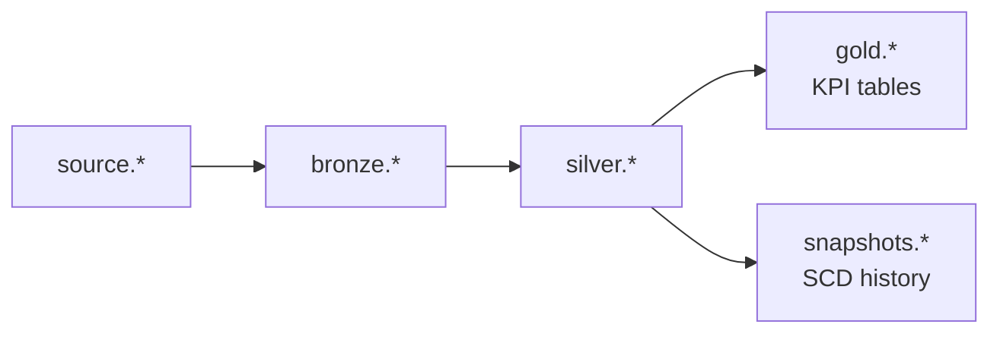

# Gold layer

The **gold** layer delivers **business-ready metrics** for dashboards, reports, and stakeholders. Models aggregate cleansed **silver** data into KPI tables in schema **`gold`**. See [silver](../silver/README.md) for upstream entities and the [project README](../../README.md) for the full medallion flow.

---

## Purpose

| Gold does | Gold does not |
|-----------|----------------|
| Aggregate facts and dimensions into KPIs | Raw staging (bronze) |
| Join multiple silver models for reporting | Row-level cleansing (silver) |
| Answer business questions (revenue, returns, LTV) | Track history over time (snapshots) |

Gold is the **presentation layer** — optimized for BI tools (Tableau, Power BI) and ad hoc analytics.

---

## Configuration

From `dbt_project.yml`:

```yaml
gold:
  +materialized: table
  schema: gold
```

---

## Medallion position



| Layer | Grain | Example question |
|-------|-------|------------------|
| Silver | One row per sale, customer, product | "What is this sale's net amount?" |
| **Gold** | Aggregated (daily/store, per customer, etc.) | "What was net revenue by store last month?" |
| Snapshots | History of dimension changes | "What was this customer's email in March?" |

---

## Models

| Model | Grain | Built from | Business use |
|-------|-------|------------|--------------|
| [gold_sales_daily.sql](gold_sales_daily.sql) | `calendar_date` + `store_sk` | `silver_sales`, `silver_date`, `silver_store` | Daily revenue trends by store |
| [gold_store_performance.sql](gold_store_performance.sql) | `store_sk` | `silver_store`, `silver_sales`, `silver_returns` | Store scorecard: sales vs returns |
| [gold_customer_overview.sql](gold_customer_overview.sql) | `customer_sk` | `silver_customer`, `silver_sales`, `silver_date` | Customer LTV, order frequency |
| [gold_product_performance.sql](gold_product_performance.sql) | `product_sk` | `silver_product`, `silver_sales`, `silver_returns` | Product/category performance |

### `gold_sales_daily` metrics

| Column | Description |
|--------|-------------|
| `order_count` | Distinct sales transactions |
| `units_sold` | Sum of quantity |
| `gross_revenue` | Sum of gross_amount |
| `total_discount` | Sum of discount_amount |
| `net_revenue` | Sum of net_amount |
| `unique_customers` | Distinct buyers that day at that store |
| `promoted_order_lines` | Lines with a promotion applied |

### `gold_store_performance` metrics

| Column | Description |
|--------|-------------|
| `net_revenue` | Total sales net amount |
| `total_refunds` | Sum of return refunds |
| `net_revenue_after_returns` | Sales minus refunds |
| `product_issue_returns` | Returns flagged as damaged/defective |
| `fulfillment_issue_returns` | Late delivery / wrong item |
| `customer_initiated_returns` | Changed mind |

### `gold_customer_overview` metrics

| Column | Description |
|--------|-------------|
| `lifetime_net_spend` | Total net purchase amount |
| `avg_order_value` | Average net amount per order line |
| `first_purchase_date` / `last_purchase_date` | Customer activity window |
| `stores_shopped` | Distinct stores visited |

### `gold_product_performance` metrics

| Column | Description |
|--------|-------------|
| `units_sold` / `net_revenue` | Sales by product |
| `unique_buyers` | Distinct customers who bought the product |
| `return_line_count` / `total_refunds` | Return activity per product |

---

## Entity relationships

```text
gold_sales_daily     ← silver_sales + silver_date + silver_store
gold_store_performance ← silver_store + silver_sales + silver_returns
gold_customer_overview ← silver_customer + silver_sales + silver_date
gold_product_performance ← silver_product + silver_sales + silver_returns
```

All gold models depend on **silver** being built first. Store and product gold models also need **`silver_returns`** (and upstream `bronze_returns`).

---

## Prerequisites (data)

Gold models read from silver — no separate source load. Ensure this pipeline has run:

```bash
dbt run --select +gold
```

Minimum upstream:

| Required silver models | Required bronze/source |
|------------------------|------------------------|
| `silver_sales` | `fact_sales` |
| `silver_date` | `dim_date` |
| `silver_store` | `dim_store` |
| `silver_customer` | `dim_customer` |
| `silver_product` | `dim_product` |
| `silver_returns` | `fact_returns` |

---

## Commands

```bash
# All gold models (includes silver parents via +)
dbt run --select +gold

# One model
dbt run --select gold_store_performance

# Gold + tests
dbt build --select +gold

# Preview top stores (analysis — compile only)
dbt compile --select path:analyses/gold_layer_preview.sql
```

Run compiled preview SQL in Databricks from:

```text
target/compiled/dbt_learning/analyses/gold_layer_preview.sql
```

---

## Data quality

Tests in [properties.yml](properties.yml):

| Model | Tests |
|-------|-------|
| `gold_sales_daily` | `not_null` on keys; `generic_non_negative` on `net_revenue` |
| `gold_store_performance` | `unique` + `not_null` on `store_sk` |
| `gold_customer_overview` | `unique` + `not_null` on `customer_sk` |
| `gold_product_performance` | `unique` + `not_null` on `product_sk` |

```bash
dbt test --select gold
```

---

## Gold vs silver vs snapshots (interview)

| | Silver | Gold | Snapshot |
|---|--------|------|----------|
| **Grain** | Entity / transaction | Aggregated KPI | Historical versions |
| **Audience** | Data engineers, model builders | Analysts, executives | Compliance, point-in-time |
| **Command** | `dbt run` | `dbt run` | `dbt snapshot` |
| **Example** | One row per sale | Revenue per store per day | Customer email history |

---

## Practice challenges

1. Add `gold_monthly_revenue` — aggregate `gold_sales_daily` by `year_month` and `region`.
2. Add a gold model joining `gold_customer_overview` to promotion usage from `silver_sales`.
3. Build a Tableau/Power BI chart from `gold_store_performance` — net revenue after returns by region.
4. Add `relationships` test: `gold_sales_daily.store_sk` → `silver_store.store_sk`.
5. Compare row counts: `silver_sales` vs sum of `gold_sales_daily.order_count` — should they match? Why or why not?

---

## Further reading

- [Medallion architecture](https://www.databricks.com/glossary/medallion-architecture)
- [dbt model configurations](https://docs.getdbt.com/docs/build/materializations)
- [Silver layer](../silver/README.md)
- [Snapshots / SCD](../../snapshots/README.md)
