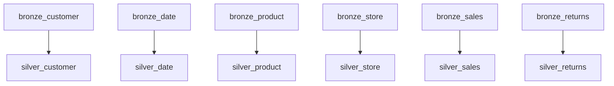

# Silver layer

The **silver** layer cleanses and enriches bronze data into schema **`silver`** as **tables**. See [bronze](../bronze/README.md) for upstream staging and the [project README](../../README.md) for the full repo.

---

## Purpose

| Silver does | Silver does not |
|-------------|-----------------|
| Trim, cast, round amounts | Final KPI dashboards (gold) |
| Filter invalid rows | Replace bronze/source ingestion |
| Add derived flags (e.g. `has_promotion`, `price_tier`) | Materialize heavy tables (configured as views) |

Silver is **conformed, analytics-ready** data at the same grain as bronze (per entity), ready for joins and gold aggregates.

---

## Configuration

From `dbt_project.yml`:

```yaml
silver:
  +materialized: table
  schema: silver
```

---

## Models

| Model | Built from | Main transformations |
|-------|------------|----------------------|
| [silver_customer.sql](silver_customer.sql) | `bronze_customer` | `customer_name` from first/last; email lower/trim; gender labels; `has_valid_email` |
| [silver_date.sql](silver_date.sql) | `bronze_date` | `calendar_date`; boolean flags from string; `year_month` |
| [silver_product.sql](silver_product.sql) | `bronze_product` | Trim text; `round_column` on `list_price`; `price_tier` |
| [silver_store.sql](silver_store.sql) | `bronze_store` | `country_code` (US/CA); `open_date` cast; `is_us_store` |
| [silver_sales.sql](silver_sales.sql) | `bronze_sales` | Round money columns; `has_promotion`, `discount_rate`; quality filters |
| [silver_returns.sql](silver_returns.sql) | `bronze_returns` | Round `refund_amount`; return reason flags (`is_product_issue`, etc.) |

### Macros used

- [`round_column`](../../macros/round_macro.sql) — used in `silver_product`, `silver_sales`, `silver_returns`
- [`multiply_columns`](../../macros/multiply_columns.sql) — available for future models

---

## Entity relationships (logical)

```text
silver_sales ──┬── date_sk    → silver_date
               ├── store_sk   → silver_store
               ├── product_sk → silver_product
               └── customer_sk → silver_customer

silver_returns ── sales_id → silver_sales (logical link; no FK in warehouse)
               ├── date_sk, store_sk, product_sk → same dims
```

A wide **sales detail** model (optional) would join fact + all dims in one SQL file.

---

## `silver_sales` filters

Rows are dropped when:

- Any of `sales_id`, `date_sk`, `store_sk`, `product_sk`, `customer_sk` is null
- `quantity <= 0`
- `gross_amount`, `discount_amount`, or `net_amount` is negative

Compare bronze vs filtered counts: [analyses/test_sales_data.sql](../../analyses/test_sales_data.sql).

---

## `silver_returns` notes

- Grain: return line linked by `sales_id` (no separate `return_id` in source)
- Requires **`bronze_returns`** to exist before run — see [bronze README](../bronze/README.md)

---

## Commands

```bash
# All silver (bronze must already exist)
dbt run --select silver

# Silver + any missing bronze parents (recommended)
dbt run --select +silver

# Subset
dbt run --select silver_sales silver_customer

# After adding bronze_returns
dbt run --select bronze_returns silver_returns

# Compile only (preview SQL)
dbt compile --select silver_sales
```

**Note:** `dbt run --select silver` does **not** build bronze automatically unless you use `+`:

```bash
dbt run --select +silver    # includes upstream bronze
```

---

## Dependency graph



---

## Optional next steps

| Item | Why |
|------|-----|
| `models/silver/properties.yml` | `relationships` tests to dims |
| `silver_sales_detail` | One joined wide table for BI |
| [Gold layer](../gold/README.md) | KPI aggregates built from these silver models |

---

## Further reading

- [Bronze layer](../bronze/README.md)
- [Gold layer](../gold/README.md)
- [Macros — compile helper via analyses](../../macros/README.md)
- [Analyses](../../analyses/README.md)
- [Commands](../../commands/README.md)
