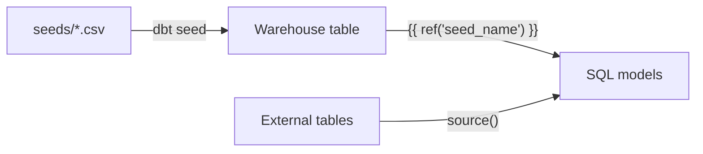

# dbt Seeds

Documentation for the `seeds/` folder in **dbt_learning**. Seeds are one dbt resource type; other concepts are documented in their own folders (see the [project README](../README.md)).

---

## What is a seed?

In dbt, a **seed** is a small CSV file that lives in your project (by default in the `seeds/` folder) and is **loaded into your data warehouse as a table** when you run:

```bash
dbt seed
```

Think of seeds as **version-controlled reference data**. You check the CSV into Git, dbt reads it, infers column types, and creates or refreshes a table your models can query—just like any other dbt relation.

Seeds are **not** models: you do not write SQL to define them. You only provide the file (and optional YAML configuration). dbt handles the `CREATE TABLE` / load step for you.

---

## What are seeds for?

Seeds are a good fit when data is:

- **Small** — typically from a few rows up to tens of thousands (not millions).
- **Stable or slow-changing** — country codes, status mappings, fiscal calendars, team-owned lookup tables.
- **Owned by analytics** — you want the same values in dev, CI, and prod without a separate ETL job.
- **Useful in development** — sample dimensions or mappings so you can build models before production pipelines exist.

| Use case | Example contents |
|----------|------------------|
| Lookup / mapping | `country_code` → `country_name` |
| Business rules | Which `status` values count as “active” |
| Test fixtures | Minimal rows to validate joins in CI |
| Manual overrides | One-off corrections while upstream fixes land |

Seeds are **not** a replacement for main fact and dimension tables loaded by ingestion tools. Those belong in **sources** (tables built outside dbt). Seeds complement the pipeline for small tables that are easier to maintain as CSV in the repo.

---

## How seeds fit in the dbt workflow



1. Add a CSV under `seeds/` (header row + data rows).
2. Configure the seed (optional) in `dbt_project.yml` or a YAML properties file.
3. Run `dbt seed` — dbt creates or updates a table in the target database/schema.
4. Reference it in models with `{{ ref('lookup_test') }}` — the seed name is the **filename without `.csv`**.

### Files in this folder

| File | Purpose |
|------|---------|
| `lookup_test.csv` | Sample customer id → name lookup for learning and joins |

### Project configuration

In this project, `lookup_test` is configured to land in the **bronze** schema as a table:

```yaml
# dbt_project.yml (excerpt)
seeds:
  dbt_learning:
    - name: lookup_test
      schema: bronze
      config:
        materialized: table
```

Example (`lookup_test.csv`):

```csv
customer_id,customer_name
1,John Doe
2,Jane Smith
```

Use **snake_case headers with no spaces** after commas. A header like `customer_id, customer_name` creates a column named ` customer_name` (leading space), which can fail on Databricks Delta.

---

## Seeds vs sources vs models

| Concept | What it is | Who loads the data | How you reference it |
|---------|------------|--------------------|----------------------|
| **Seed** | CSV in `seeds/` | **dbt** (`dbt seed`) | `{{ ref('lookup_test') }}` |
| **Source** | Table already in the warehouse | Ingestion / ELT outside dbt | `{{ source('source', 'dim_customer') }}` |
| **Model** | SQL in `models/` | **dbt** (`dbt run`) | `{{ ref('bronze_sales') }}` |

**Rule of thumb:** Small file in the repo → seed. Already in the warehouse from another system → source. Needs SQL transforms → model.

---

## Commands

```bash
# From the dbt_learning project directory

# Load all seeds
dbt seed

# Load one seed only
dbt seed --select lookup_test

# Drop and recreate (useful after column/header changes)
dbt seed --select lookup_test --full-refresh
```

Seeds do **not** run automatically on `dbt run`. Run `dbt seed` when CSVs change or in CI before tests that depend on them.

---

## Configuration and documentation

**Project-level** — under `seeds:` in `dbt_project.yml`:

```yaml
seeds:
  dbt_learning:
    lookup_test:
      +schema: bronze
      +column_types:
        customer_id: integer
```

**YAML docs and tests** — You can attach descriptions and generic tests (`not_null`, `unique`, etc.) to seed columns the same way as for models.

**Warehouse notes (Databricks / Delta)** — Column names come from the CSV header row. Delta rejects certain characters in column names (spaces, `;`, `{}`, etc.). Keep headers clean: `customer_id,customer_name`.

---

## Best practices

1. **Keep seeds small** — use proper ingestion for large datasets.
2. **Treat headers as contracts** — renaming columns may require `--full-refresh`.
3. **Document in YAML** — explain what each seed is for and who owns updates.
4. **Test critical columns** — catch bad CSV edits before they break joins.
5. **Run seeds in CI** — if models `ref()` a seed, run `dbt seed` before `dbt run` / `dbt test`.

---

## When not to use a seed

- Large or fast-growing datasets → **sources** + ingestion.
- Frequently changing operational data → **sources** + staging models.
- Complex incremental logic → **models** reading from sources.

---

## Further reading

- [dbt seeds](https://docs.getdbt.com/docs/build/seeds)
- [Seed configs](https://docs.getdbt.com/reference/seed-configs)
