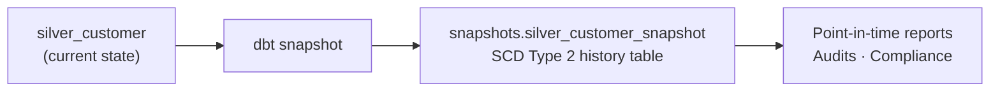
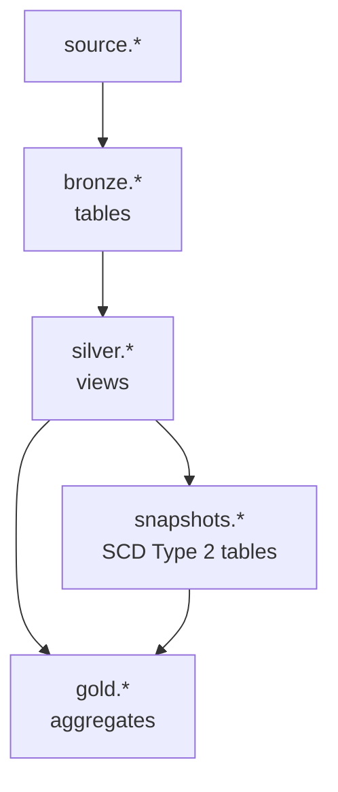

# dbt Snapshots

Documentation for the `snapshots/` folder in **dbt_learning**. Snapshots capture **how data changes over time** — the dbt resource for **Slowly Changing Dimensions (SCD)**. See the [project README](../README.md), [bronze](../models/bronze/README.md), and [silver](../models/silver/README.md) layers for upstream context.

---

## What is a snapshot?

A **snapshot** is a dbt SQL file under `snapshots/` that:

1. Reads from a **source table or model** (e.g. `silver_customer`)
2. Compares each run to the **previous snapshot state**
3. **Inserts new rows** when data changes and **closes out** old versions

Run snapshots with:

```bash
dbt snapshot
```

Unlike `dbt run` (which **replaces** or **merges** a model’s current state), snapshots **preserve history** — you can answer *“What was this customer’s email on March 1?”*



---

## Why snapshots exist (the business problem)

Operational systems usually store **only the latest version** of a row. When a customer changes their email, the old value is overwritten.

| Question | Regular model (`dbt run`) | Snapshot (`dbt snapshot`) |
|----------|---------------------------|---------------------------|
| What is the email **today**? | Yes | Yes (current open row) |
| What was the email **last month**? | No | Yes |
| When did the address change? | No | Yes (`dbt_valid_from` / `dbt_valid_to`) |
| How many versions of this customer exist? | No | Yes |

**Snapshots are for audit, compliance, and historical analytics** — not for everyday staging or cleansing (that is bronze/silver).

---

## SCD types (interview essentials)

**SCD** = Slowly Changing Dimension — patterns for tracking dimension changes in a data warehouse.

| Type | What it keeps | Example | dbt support |
|------|---------------|---------|-------------|
| **Type 1** | Overwrite — no history | Fix typo in customer name | Normal `dbt run` model (no snapshot) |
| **Type 2** | Full history — new row per change | Email changed → old row closed, new row opened | **``** (primary use case) |
| **Type 3** | Limited history — one “previous value” column | `current_city`, `previous_city` | Custom model logic (rare in dbt snapshots) |

**In interviews, say:** *“dbt snapshots implement SCD Type 2 out of the box. Type 1 is just a regular incremental or table model. Type 3 I’d usually build explicitly in SQL if the business only needs one prior value.”*

---

## How dbt snapshots work (SCD Type 2)

On each `dbt snapshot` run, dbt:

1. **Reads** the current input query (e.g. all rows from `silver_customer`)
2. **Compares** tracked columns to the latest open version in the snapshot table (`dbt_valid_to is null`)
3. **If unchanged** — does nothing for that row
4. **If changed** — sets `dbt_valid_to` on the old row and **inserts** a new row with `dbt_valid_from = now`
5. **If new key** — inserts a new row with `dbt_valid_from = now`, `dbt_valid_to = null`

### Metadata columns dbt adds automatically

| Column | Meaning |
|--------|---------|
| `dbt_scd_id` | Surrogate key for each snapshot row (unique version id) |
| `dbt_updated_at` | When dbt last processed this row |
| `dbt_valid_from` | When this version became active |
| `dbt_valid_to` | When this version was superseded (`null` = **current** row) |

**Query the current state:**

```sql
select *
from snapshots.silver_customer_snapshot
where dbt_valid_to is null
```

**Query as-of a date:**

```sql
select *
from snapshots.silver_customer_snapshot
where dbt_valid_from <= '2026-03-01'
  and (dbt_valid_to > '2026-03-01' or dbt_valid_to is null)
```

---

## Snapshot strategies

dbt supports two strategies — you declare one inside ``.

### 1. `timestamp` strategy

Use when the source has a reliable **“last updated”** column (e.g. `updated_at`, `_fivetran_synced`).

```jinja


{{
    config(
      target_schema='snapshots',
      unique_key='customer_sk',
      strategy='timestamp',
      updated_at='updated_at',
    )
}}

select * from {{ ref('silver_customer') }}


```

| Pros | Cons |
|------|------|
| Efficient — only checks rows updated since last run | Requires trustworthy timestamp in source |
| Good for large tables | Misses changes if timestamp not bumped on edit |

### 2. `check` strategy

Use when there is **no reliable updated timestamp**, or you want to detect changes by **comparing column values**.

```jinja


{{
    config(
      target_schema='snapshots',
      unique_key='customer_sk',
      strategy='check',
      check_cols=['email', 'customer_name', 'gender'],
    )
}}

select * from {{ ref('silver_customer') }}


```

| `check_cols` option | Behavior |
|---------------------|----------|
| List of columns | Compare only those columns |
| `'all'` | Compare every column (expensive on wide tables) |

| Pros | Cons |
|------|------|
| Works without `updated_at` | Full compare each run — slower at scale |
| Explicit about what “change” means | Must choose columns carefully |

**Interview tip:** *“I use `timestamp` when the source maintains `updated_at` from the application or CDC tool. I use `check` for legacy systems or when I only care about specific business columns changing.”*

---

## Example for this project

A natural candidate in **dbt_learning** is **`silver_customer`** — email, name, and gender can change over time.

`snapshots/silver_customer_snapshot.sql` (example — not yet in repo):

```jinja


{{
    config(
      target_schema='snapshots',
      unique_key='customer_sk',
      strategy='check',
      check_cols=['email', 'customer_name', 'gender', 'has_valid_email'],
    )
}}

select
    customer_sk,
    customer_name,
    email,
    gender,
    has_valid_email
from {{ ref('silver_customer') }}


```

**Before first run:**

```bash
dbt run --select silver_customer    # snapshot reads from this model
dbt snapshot --select silver_customer_snapshot
```

**Simulate a change (dev):** update email in source → re-run bronze → silver → snapshot. You should see two rows for the same `customer_sk` — one closed, one open.

---

## Snapshots vs models vs sources

| | **Snapshot** | **Model** | **Source** |
|---|--------------|-----------|------------|
| **Folder** | `snapshots/` | `models/` | `models/source/` (YAML) |
| **Command** | `dbt snapshot` | `dbt run` | *(external load)* |
| **Purpose** | Historical versions (SCD Type 2) | Transform current data | Declare external tables |
| **History** | Yes | No (current state only) | No |
| **Reference** | N/A (snapshots are leaf nodes) | `ref()`, `source()` | `source()` |
| **This project** | *planned* | bronze / silver / gold | `fact_sales`, `dim_customer`, … |

**Rule of thumb:**

- **Source** — data lands from outside dbt
- **Model** — you shape *what is true now*
- **Snapshot** — you record *what was true over time*

---

## Where snapshots sit in the medallion architecture



| Layer | Snapshot here? | Why |
|-------|----------------|-----|
| Bronze | Rarely | Raw mirrors change too often; history belongs after cleansing |
| **Silver** | **Yes — common** | Clean, conformed dimensions ready for SCD |
| Gold | Sometimes | Usually aggregate from snapshot history, not snapshot facts directly |
| Snapshots schema | **Default home** | Dedicated schema keeps history tables separate from silver views |

In this project, snapshot **after silver** so tracked columns are already trimmed, cast, and validated.

---

## Configuration

### Project paths (`dbt_project.yml`)

```yaml
snapshot-paths: ["snapshots"]
```

### Per-snapshot config (inside ``)

| Config | Required | Description |
|--------|----------|-------------|
| `unique_key` | Yes | Business key — one open row per key at a time |
| `strategy` | Yes | `timestamp` or `check` |
| `updated_at` | For `timestamp` | Column that changes when row changes |
| `check_cols` | For `check` | Columns to compare, or `'all'` |
| `target_schema` | No | Where snapshot table lives (e.g. `snapshots`) |
| `target_database` | No | Override database/catalog |
| `invalidate_hard_deletes` | No | If `true`, close rows deleted from source (default `false`) |

### Hard deletes

If a row disappears from the source:

| `invalidate_hard_deletes` | Behavior |
|---------------------------|----------|
| `false` (default) | Deleted source rows stay “open” forever in snapshot |
| `true` | dbt sets `dbt_valid_to` on missing rows — treats delete as a change |

**Interview answer:** *“By default dbt snapshots don’t assume deletes are real — the row might just be missing from an incremental load. I enable `invalidate_hard_deletes` when the source is a full extract or I trust that deletes are intentional.”*

---

## Commands

```bash
# From dbt_learning/

# Run all snapshots
dbt snapshot

# One snapshot only
dbt snapshot --select silver_customer_snapshot

# Full refresh (drop and rebuild snapshot table — dev only)
dbt snapshot --select silver_customer_snapshot --full-refresh

# Typical order when building from scratch
dbt run --select +silver
dbt snapshot
```

Snapshots do **not** run on `dbt run` or `dbt build` by default in all dbt versions — check your version. In dbt 1.x+, `dbt build` can include snapshots if selected:

```bash
dbt build --select +silver_customer_snapshot
```

List snapshot nodes:

```bash
dbt ls --resource-type snapshot
```

---

## Best practices

1. **Snapshot cleansed data** — prefer `ref('silver_*')` over raw `source()` so history reflects business-ready values.
2. **Choose `unique_key` carefully** — must be stable (e.g. `customer_sk`, not a name that can change).
3. **Limit `check_cols`** — only columns that matter for history; avoids noise from metadata columns.
4. **Dedicated schema** — use `target_schema='snapshots'` so history tables don’t mix with silver views.
5. **Document in YAML** — add `snapshots:` properties for descriptions and tests on snapshot outputs.
6. **Test current row uniqueness** — ensure one open row per `unique_key` (custom test or query in CI).
7. **Schedule separately** — snapshots can run less often than hourly models if source change frequency is low.
8. **Avoid snapshotting facts at line-item grain** unless you need it — history tables grow fast.

---

## Common mistakes

| Mistake | Fix |
|---------|-----|
| Running `dbt run` expecting snapshots to update | Use `dbt snapshot` |
| `unique_key` not unique in source | Fix upstream; add tests on silver |
| `check_cols='all'` on wide tables | List only business columns |
| Snapshotting bronze before cleansing | Snapshot silver (or late bronze) |
| No `updated_at` but using `timestamp` strategy | Switch to `check` or add reliable timestamp |
| Surprised by row count growth | Expected for SCD Type 2 — plan retention/archival |
| Hard deletes not reflected | Set `invalidate_hard_deletes=true` if appropriate |

---

## Interview cheat sheet

### “What is a dbt snapshot?”

> A dbt snapshot is an incremental history capture that implements SCD Type 2. On each run it compares the current source to the snapshot table, closes changed rows by setting `dbt_valid_to`, and inserts new versions. It lets us report on past states without changing the operational system.

### “Snapshot vs incremental model?”

| | **Incremental model** | **Snapshot** |
|---|----------------------|--------------|
| Goal | Efficiently load **new/changed** rows into one table | Keep **every version** of a row |
| Typical output | One row per business key (latest) | Multiple rows per key over time |
| Use case | Fact tables, append-only events | Dimensions that change (customer, product, store) |

### “When would you NOT use a snapshot?”

> When we only need the latest state (SCD Type 1), when the source already provides full change-data capture (CDC) we ingest elsewhere, when the table is huge and history isn’t required, or when append-only event streams already capture changes (e.g. audit log table).

### “What strategy would you pick for `silver_customer`?”

> If `dim_customer` has `updated_at` maintained by the app, I’d use `timestamp` on bronze/silver. If not, I’d use `check` on `email`, `customer_name`, and `gender` after silver cleansing — which matches how this project models customer data.

### “How do you query point-in-time?”

> Filter where the as-of date is between `dbt_valid_from` and `dbt_valid_to`, treating `null` in `dbt_valid_to` as “still current.”

---

## Files in this folder

| File | Status | Purpose |
|------|--------|---------|
| `.gitkeep` | Present | Placeholder until first snapshot is added |
| `silver_customer_snapshot.sql` | *Planned* | SCD Type 2 history for customer dimension |

---

## Practice challenges

1. Add `silver_customer_snapshot.sql` using the `check` strategy and run `dbt snapshot`.
2. Change a customer email in source, re-run bronze → silver → snapshot, and query both versions.
3. Write a SQL analysis: *“How many customers changed email in the last 30 days?”* using `dbt_valid_from`.
4. Compare `timestamp` vs `check` — when would each fail or misdetect changes?
5. Add a singular test: no duplicate open rows (`dbt_valid_to is null`) per `customer_sk`.

---

## Further reading

- [Add snapshots to your project](https://docs.getdbt.com/docs/build/snapshots)
- [Snapshot configurations](https://docs.getdbt.com/reference/snapshot-configs)
- [Snapshot meta fields](https://docs.getdbt.com/reference/resource-configs/snapshot_meta_column_names)
- [Silver layer in this project](../models/silver/README.md)
- [dbt commands — snapshots](../commands/README.md) *(add snapshot section when ready)*
