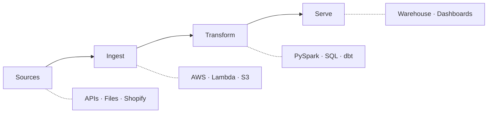

<!--
  SETUP
  =====
  1. github.com/new → Repository name: tyagipiyush-git
  2. Add a README → Create
  3. Replace contents with everything below this comment → Commit
-->

# Piyush Tyagi

**Data Engineer** · New Delhi, India

I build **ETL/ELT pipelines** on AWS — ingesting, transforming, and delivering data for analytics and operations. Currently deepening **dbt** and **Databricks** for modern analytics engineering.

[`LinkedIn`](https://www.linkedin.com/in/piyush--tyagi/) · [`Email`](mailto:piyush.del.tyagi@gmail.com) · [`dbt-repo`](https://github.com/tyagipiyush-git/dbt-repo)

---

## Stack

**Languages & compute**
<br>


**Cloud & orchestration**
<br>


**Data platforms**
<br>


<details>
<summary><strong>Full toolkit</strong></summary>

| | |
|---|---|
| **Ingestion** | S3 · Lambda · Glue · ECS · FastAPI · GraphQL · Webhooks |
| **Storage** | PostgreSQL · MySQL · Redshift · DynamoDB · Parquet · JSON |
| **Delivery** | Tableau · Power BI · REST APIs |
| **DevOps** | Git · GitHub Actions · CI/CD · CloudWatch |

</details>

---

## How I work



---

## Projects

### [dbt-repo](https://github.com/tyagipiyush-git/dbt-repo)

**dbt + Databricks · Medallion architecture**

Bronze staging → silver cleansing → gold aggregates. Includes custom macros, generic data tests, Jinja analyses, and layer-by-layer documentation.

```bash
cd dbt_learning && dbt run --select +silver && dbt test
```

### [sql-practice-arena](https://github.com/tyagipiyush-git/sql-practice-arena)

**Interactive SQL practice app** — hands-on query drills and exercises.

---

## Background

| | |
|---|---|
| **Now** | Data Engineer @ Flodata Analytics — real-time ETL, AWS, FastAPI, Shopify integrations |
| **Before** | Data Analyst @ GlobalLogic (Google AI/ML) · Intern @ Dot Communication |
| **Education** | B.Sc. (Hons) Mathematics — University of Delhi |

**Certifications:** HackerRank SQL Gold (5★) · Google Advanced Data Analytics (Coursera) · Trainity Bootcamp — 5th of 200+

<details>
<summary><strong>Currently exploring</strong></summary>

- Gold-layer KPI models in dbt
- CI/CD for dbt with GitHub Actions
- Medallion patterns on Databricks

</details>

---

<p align="left">
  <strong>Open to data engineering & analytics collaborations.</strong><br>
  <a href="https://www.linkedin.com/in/piyush--tyagi/">Connect on LinkedIn →</a>
</p>
